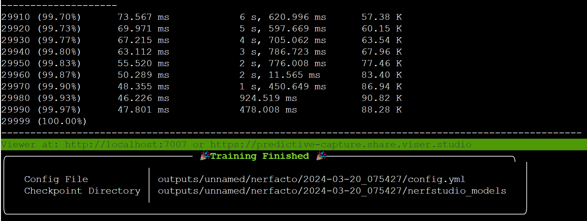
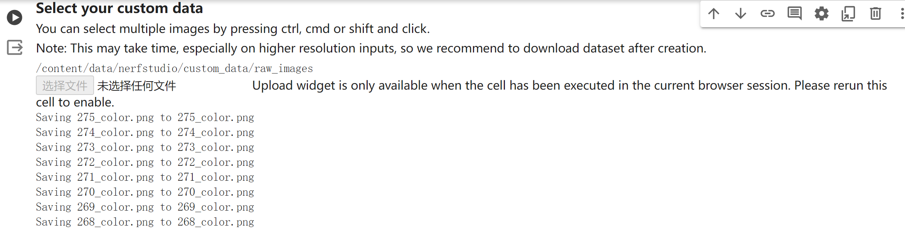

----------
###### Title: 2024 Robotics and Computation Dissertation - Week 1
###### Date: 18-03-2024 -- 22-03-2024
----------
###### Monday
> - First meeting with supervisor Baoru Huang
&nbsp;
----------
###### Tuesday
> - Learn all basic git cmd
> - Take notes in [git_cmds](../git_cmds.txt)
&nbsp;
----------
###### Wednesday
> - Learn Nerf methodologies
> - Train [Nerfacto](https://docs.nerf.studio/nerfology/methods/nerfacto.html) on Colab with nerf studio demo codes, while checking rendering from [Viewer](https://viewer.nerf.studio/)

&nbsp;
----------
###### Thursday
> - Read Nerf Doc:

  Methods:
    Instant-NGP
    Splatfacto
    Nerf
    Nerfacto

  Model Components:
  
    Cameras models:
      Perspective Camera Model
      Fisheye Camera Model
      Equirectangular/Spherical Camera Model
      Distortion Parameters
      
    Sample representation:
      3D Frustum
      Representing Frustums as Points
      Representing Frustums as Gaussians
      
    Ray samplers:
      Stratified Sampling
      Hierarchical Sampling
      Spaced Samplers
      Probability Distribution Function (PDF) Sampler
      
    Spatial distortions:
      Scene Contraction with L2 or L infinity norm
      
    Encoders:
      Random Fourier Feature (RFF) Encoding
      Hash Encoding
      Spherical Harmonic Encoding

&nbsp;
----------
###### Friday
> - Upload Colonoscopy 3D Video Dataset ([C3VD](https://durrlab.github.io/C3VD/)) to Colab and train. (failed)

&nbsp;

> ###### [Next Week](Week2.md)
