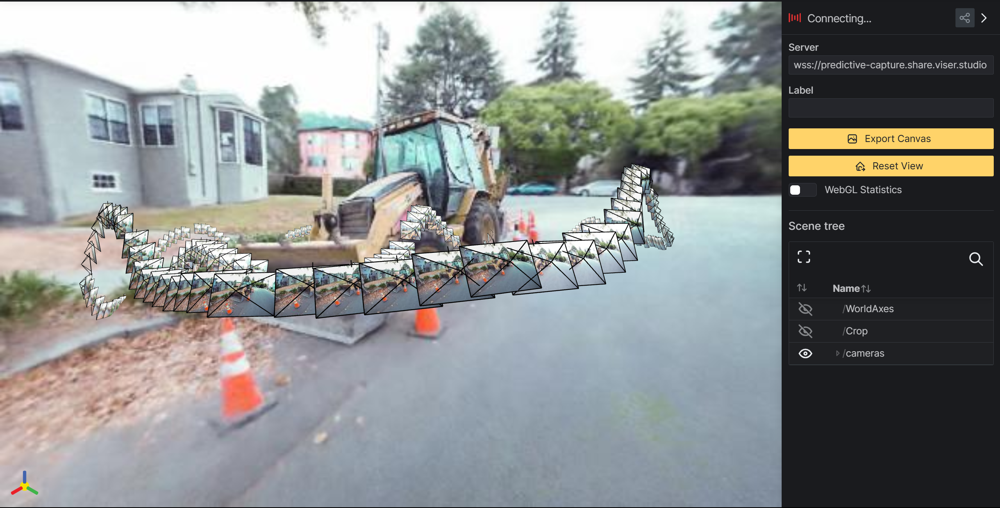

----------
###### Title: 2024 Robotics and Computation Dissertation - Week 1
###### Date: 18-03-2024 -- 22-03-2024
----------
###### Monday
> - First meeting with supervisor Baoru Huang
&nbsp;
----------
###### Tuesday
> - Learn all basic git cmd
> - Take notes in [git_cmds](../git_cmds.txt)
&nbsp;
----------
###### Wednesday
> - Learn Nerf methodologies
> - Train [Nerfacto](https://docs.nerf.studio/nerfology/methods/nerfacto.html) on Colab with nerf studio demo codes, while checking rendering from [Viewer](https://viewer.nerf.studio/)

&nbsp;
----------
###### Thursday
> - Read Nerf Doc
&nbsp;
----------
###### Friday
> - Weekly meeting with Baoru
&nbsp;
> ###### [Next Week](Week2.md)
