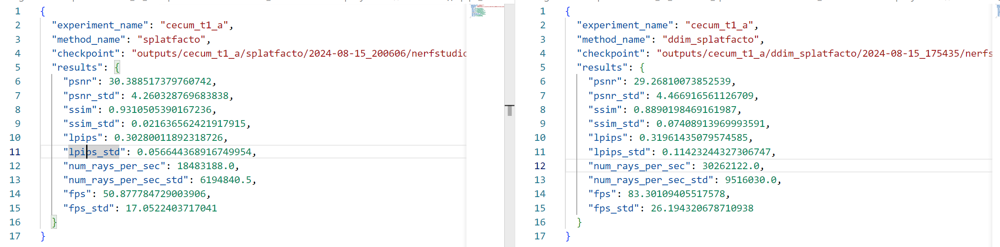

----------
###### Title: 2024 Robotics and Computation Dissertation - Week 12
###### Date: 12-08-2024 -- 16-08-2024
----------
###### Monday-Sunday

The training result is not good, and it seems that further training will only make it perform worse. Let's find out the reasons.

##### Experiment with different hyperparameters for diffusion model in the ddim_splat loop

###### First test

- Select images from novel view with 0.4 probability
- timesteps for adding noise: 50
- timesteps for denoise: 12
- Noise level: sample from standard normal distribution * 4
- Results:
  
| Non-diffused Image   | Diffused Image |
| ------------- | ------------ |
|   |  |

###### Second test

- Select images from novel view with 0.4 probability
- Conclude the problems encountered: denoising steps are not enough; forget to normalize before diffusion and denormalize after that
- timesteps for adding noise: 50
- timesteps for denoise: 15
- Noise level: sample from standard normal distribution * 4
- Results:
  
| Non-diffused Image   | Diffused Image |
| ------------- | ------------ |
|   |  |

##### Comparation between 3D Gaussian Splat and DDIM-Splat performance

###### Procedure

1. Run splatfacto(3D Gaussian Splat) for 10000 steps on original images.
2. Run ddim-splatfacto and splatfacto for another 500 steps
3. Evaluate the model with evaluation command offerd by nerfstudio

###### Analysis

1. The default evaluation is over original data that also used for train, so the Structural Similarity Index (SSIM) measuring the similarity between two images and the Learned Perceptual Image Patch Similarity (LPIPS) , a metric used to evaluate the perceptual similarity between images with Lower values indicating higher similarity, are definately with better scores for splatfacto trained on original data only.
2. num_rays_per_sec indicates the number of rays processed per second, which is a measure of rendering speed. Frames per second (FPS) is a measure of how many frames the system can render per second. Higher FPS indicates smoother performance. From the above plot of evaluation json file, we see a smoother performance and quicker rendering for DDIM Gaussian Splatting model.

Gaussian Splatting Rendering

DDIM-Splat Rendering in the same trajectory

&nbsp;
----------
&nbsp;
> ###### [Next Week](Week13.md)
