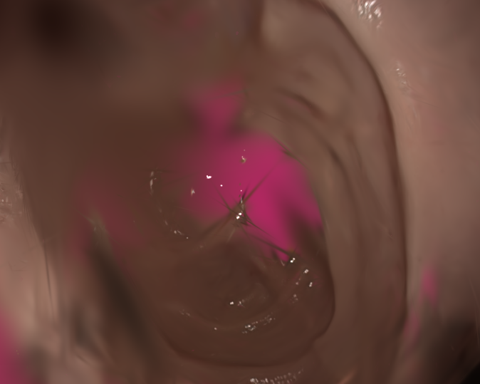
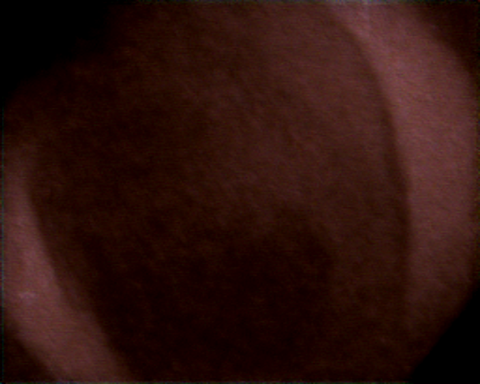
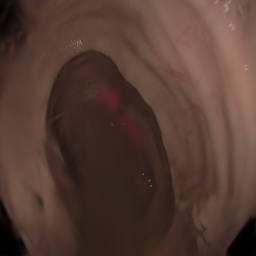
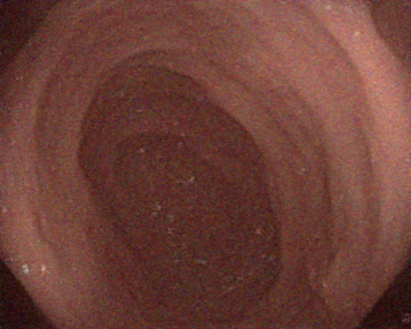

----------
###### Title: 2024 Robotics and Computation Dissertation - Week 12
###### Date: 12-08-2024 -- 16-08-2024
----------
###### Monday-Sunday

##### Experiment with different hyperparameters for diffusion model in the loop

###### First test

- timesteps for adding noise: 50
- timesteps for denoise: 12
- Noise level: sample from standard normal distribution * 4
- Results:
  
| Non-diffused Image   | Diffused Image |
| ------------- | ------------ |
|   |  |

###### Second test

- Conclude the problems encountered: denoising steps are not enough; forget to normalize before diffusion and denormalize after that
- timesteps for adding noise: 50
- timesteps for denoise: 15
- Noise level: sample from standard normal distribution * 4
- Results:
  
| Non-diffused Image   | Diffused Image |
| ------------- | ------------ |
|   |  |

&nbsp;
----------
&nbsp;
> ###### [Next Week](Week13.md)
