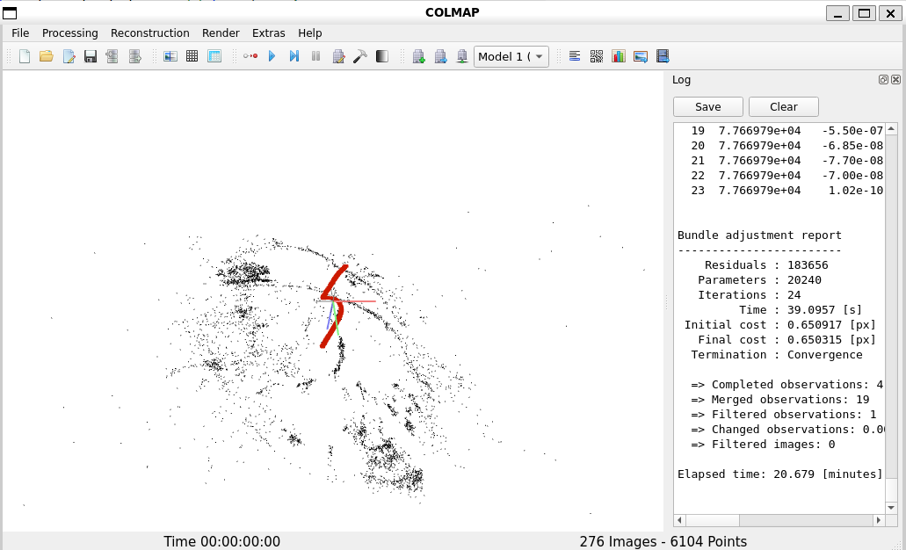

----------
###### Title: 2024 Robotics and Computation Dissertation - Week 2
###### Date: 25-03-2024 -- 29-03-2024
----------
###### Monday
> - Fail to run Colmap on Windows
> - Install Windows Subsystem for Linux (WSL) and Colmap for analysing why it fails to train nerf with provided demo codes.
&nbsp;
----------
###### Tuesday
> - Try to run Colmap with different datasets
```
$ colmap -h
$ colmap gui
```
Steps in Colmap:

1. New project
2. Feature extraction
3. Feature matching
4. Start reconstruction
5. Export model to a new folder:0
   - Nerf_00
     - images
     - database
     - sparse
       - 0
       


&nbsp;
----------
###### Wednesday
----------
###### Thursday
----------
###### Friday
> - Weekly meeting with Baoru
&nbsp;
> ###### [Next Week](Week3.md)
