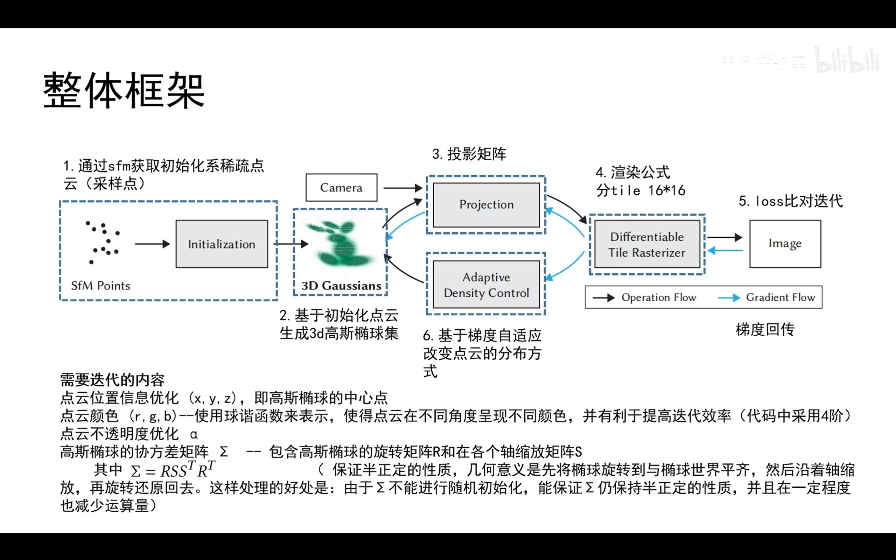
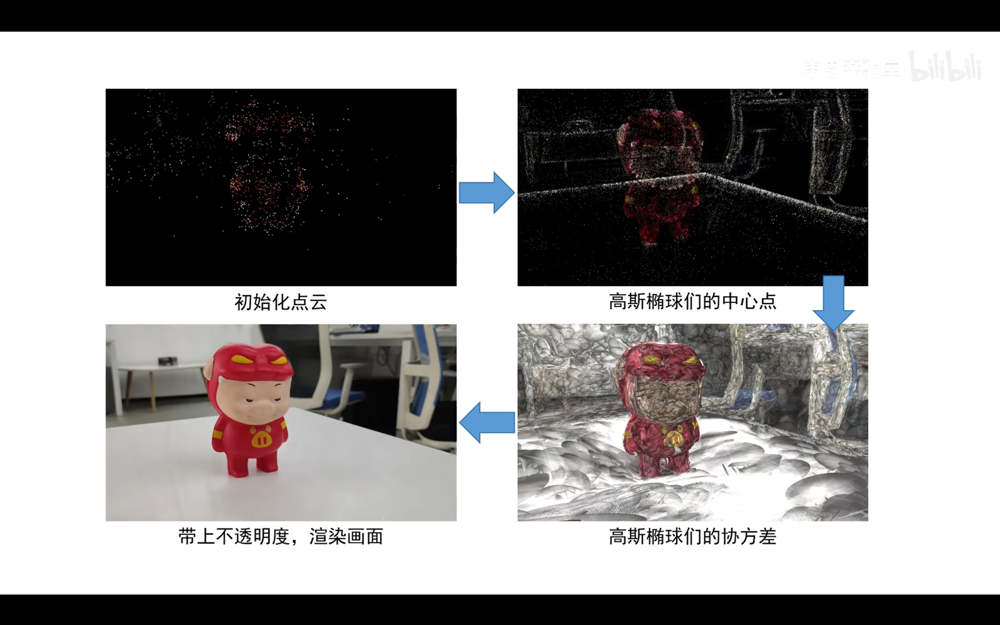

----------
###### Title: 2024 Robotics and Computation Dissertation - Week 1
###### Date: 08-04-2024 -- 14-04-2024
----------
###### Monday
> - Try Nerf Colab code from AI-Kui
&nbsp;
----------
###### Tuesday-Thursday
> - Review 3d Gaussian Splatting:

- [3D Gaussian Splatting 原理略解](https://zhuanlan.zhihu.com/p/675326584) from Zhihu;
- [3D Gaussian Splatting原理速通](https://www.bilibili.com/video/BV11e411n79b/?spm_id_from=333.788&vd_source=aadb706e826763a9918b53d9c0ee3f26) from Bilibili

- [Spherical Harmonics](https://zhuanlan.zhihu.com/p/50208005), an article from Zhihu.

&nbsp;
----------
###### Friday
----------
&nbsp;
> ###### [Next Week](Week4.md)

