----------
###### Title: 2024 Robotics and Computation Dissertation - Week 6
###### Date: 17-06-2024 -- 23-06-2024
----------
###### Monday-Sunday
#### Nerfstudio configuration on computer from start

##### Create environment
```ruby
conda create --name nerfstudio -y python=3.8
conda activate nerfstudio
python -m pip install --upgrade pip
```
##### Dependencies
```ruby
pip uninstall torch torchvision functorch tinycudann
pip install torch==2.1.2+cu118 torchvision==0.16.2+cu118 --extra-index-url https://download.pytorch.org/whl/cu118
conda install -c "nvidia/label/cuda-11.8.0" cuda-toolkit
```

##### Install tiny-cuda-nn/gsplat

Download
```ruby
git clone --recursive https://github.com/nvlabs/tiny-cuda-nn
```
Problems occured: Cuda version installed in the conda environment is not used, instead the cuda in /usr/local/ is used.

Usefull commands
```ruby
sudo update-alternatives --display cuda  # display alternatives
sudo update-alternatives --config cuda
nvcc --version  # check present cuda version
nano ~/.bashrc  # open .bashrc file and modify
```

Comment out the following in .bashrc file
```ruby
export PATH=/usr/local/cuda/bin:$PATH
export LD_LIBRARY_PATH=/usr/local/cuda/lib64:$LD_LIBRARY_PATH
```

Add the following to .bashrc file
```ruby
export PATH=$CONDA_PREFIX/bin:$PATH
export LD_LIBRARY_PATH=$CONDA_PREFIX/lib:$LD_LIBRARY_PATH
export CUDA_HOME=$CONDA_PREFIX
```
Then, apply changes with ```source ~/.bashrc```

Another error:
```ruby
(nerfstudio) wangzican@DESKTOP-0QF7VTC:~/tiny-cuda-nn$ cd bindings/torch
python setup.py install
setup.py:5: DeprecationWarning: pkg_resources is deprecated as an API. See https://setuptools.pypa.io/en/latest/pkg_resources.html
  from pkg_resources import parse_version
Traceback (most recent call last):
  File "setup.py", line 11, in <module>
    from torch.utils.cpp_extension import BuildExtension, CUDAExtension
  File "/home/wangzican/miniconda3/envs/nerfstudio/lib/python3.8/site-packages/torch/utils/cpp_extension.py", line 28, in <module>
    from pkg_resources import packaging  # type: ignore[attr-defined]
ImportError: cannot import name 'packaging' from 'pkg_resources' (/home/wangzican/miniconda3/envs/nerfstudio/lib/python3.8/site-packages/pkg_resources/__init__.py)
(nerfstudio) wangzican@DESKTOP-0QF7VTC:~/tiny-cuda-nn/bindings/torch$ pip install setuptools==66.1.1  # Solved by reinstalling the version which don't have these deprecated warnings.
```

Still, a little problem
```ruby 
error: [Errno 2] No such file or directory: '/home/wangzican/miniconda3/bin/nvcc
```

Solved by changing
```ruby
export CUDA_HOME=$CONDA_PREFIX
```
to

```ruby
export CUDA_HOME=/home/wangzican/miniconda3/envs/nerfstudio
```

Decided to change to cuda 11.7

Still couldn't run setup.py in tiny-cuda-nn:
```ruby
conda install -c conda-forge setuptools wheel numpy
pip install --upgrade setuptools packaging
# Replace pkg_resources with packaging: Modify the import statement to use packaging directly.
# from pkg_resources import parse_version
from packaging.version import parse as parse_version
```

Another error:
```ruby
cannot find -lcuda: No such file or directory
collect2: error: ld returned 1 exit status
error: command '/usr/bin/g++' failed with exit code 1
```

```ruby
# Find libcuda.so file
sudo find / -name "libcuda.so*" 2>/dev/null

/usr/lib/wsl/lib/libcuda.so
/usr/lib/wsl/lib/libcuda.so.1
/usr/lib/wsl/lib/libcuda.so.1.1
/usr/lib/wsl/drivers/nvdd.inf_amd64_67b1df330bec74ef/libcuda.so.1.1
/usr/local/cuda-12.1/targets/x86_64-linux/lib/stubs/libcuda.so
/usr/local/cuda-12.5/targets/x86_64-linux/lib/stubs/libcuda.so
/home/wangzican/miniconda3/pkgs/cuda-driver-dev_linux-64-12.4.127-hd681fbe_0/targets/x86_64-linux/lib/stubs/libcuda.so
/home/wangzican/miniconda3/pkgs/cuda-driver-dev-11.8.89-0/lib/stubs/libcuda.so
/home/wangzican/miniconda3/pkgs/cuda-driver-dev-12.4.127-h99ab3db_0/lib/stubs/libcuda.so
/home/wangzican/miniconda3/envs/nerfstudio/pkgs/cuda-toolkit/targets/x86_64-linux/lib/stubs/libcuda.so
/home/wangzican/miniconda3/envs/nerfstudio/lib/stubs/libcuda.so
/home/wangzican/miniconda3/envs/nerfstudio/targets/x86_64-linux/lib/stubs/libcuda.so

# Create symlinks in /usr/lib
sudo ln -sf /usr/lib/wsl/lib/libcuda.so /usr/lib/libcuda.so
sudo ln -sf /usr/lib/wsl/lib/libcuda.so.1 /usr/lib/libcuda.so.1
```

Successfully processing dependencies for tinycudann==1.7 ```pip install ninja git+https://github.com/NVlabs/tiny-cuda-nn/#subdirectory=bindings/torch```

##### Installing nerfstudio
From pip
```ruby
pip install nerfstudio
```

From source Optional, use this command if you want the latest development version.
```ruby
git clone https://github.com/nerfstudio-project/nerfstudio.git
cd nerfstudio
pip install --upgrade pip setuptools
pip install -e .
```
#### Tab completion (bash & zsh)

This needs to be rerun when the CLI changes, for example if nerfstudio is updated.

```ns-install-cli```
##### Development packages
```ruby
pip install -e .[dev]
pip install -e .[docs]
```

##### Download Colmap and FFmpeg
```ruby

# Installation of colmap
conda install -c conda-forge colmap
colmap -h # To check

# Installation of FFmpeg
sudo apt update && sudo apt upgrade
sudo apt install ffmpeg
ffmpeg -version
```
#### Run nerf in nerfstudio (Turtle)
```ruby
# Process data
ns-process-data images --data /home/wangzican/data/turtles/raw_images --output-dir /home/wangzican/data/turtles
# train data
ns-train nerfacto --data /home/wangzican/data/turtles
```
Successfully train nerfacto

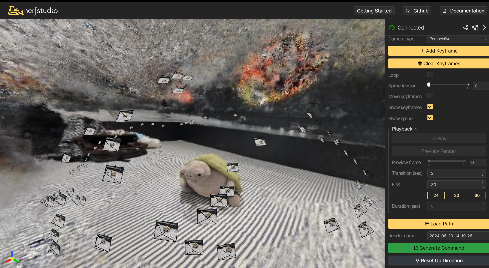

##### Wednesday

#### Train Vanilla-Nerf locally (Turtle)

Configuration:

```ruby
       model=VanillaModelConfig(
            _target=<class 'nerfstudio.models.vanilla_nerf.NeRFModel'>,
            enable_collider=True,
            collider_params={'near_plane': 2.0, 'far_plane': 6.0},
            loss_coefficients={'rgb_loss_coarse': 1.0, 'rgb_loss_fine': 1.0},
            eval_num_rays_per_chunk=4096,
            prompt=None,
            num_coarse_samples=64,
            num_importance_samples=128,
            enable_temporal_distortion=False,
            temporal_distortion_params={'kind': <TemporalDistortionKind.DNERF: 'dnerf'>},
            use_gradient_scaling=False,
            background_color='white'
        )
    ),
    optimizers={
        'fields': {
            'optimizer': RAdamOptimizerConfig(
                _target=<class 'torch.optim.radam.RAdam'>,
                lr=0.0005,
                eps=1e-08,
                max_norm=None,
                weight_decay=0
            ),
            'scheduler': None
        },
        'temporal_distortion': {
            'optimizer': RAdamOptimizerConfig(
                _target=<class 'torch.optim.radam.RAdam'>,
                lr=0.0005,
                eps=1e-08,
                max_norm=None,
                weight_decay=0
            ),
            'scheduler': None
        }
    },
    vis='wandb',
    data=PosixPath('/home/wangzican/data/turtles'),
    prompt=None,
    relative_model_dir=PosixPath('nerfstudio_models'),
    load_scheduler=True,
    steps_per_save=1000,
    steps_per_eval_batch=500,
    steps_per_eval_image=500,
    steps_per_eval_all_images=25000,
    max_num_iterations=1000000,
    mixed_precision=False,
    use_grad_scaler=False,
    save_only_latest_checkpoint=True,
    load_dir=PosixPath('/home/wangzican/outputs/turtles/vanilla-nerf/2024-06-19_160048/nerfstudio_models'),
    load_step=None,
    load_config=None,
    load_checkpoint=None,
    log_gradients=False,
    gradient_accumulation_steps={}
```
##### Run Summary

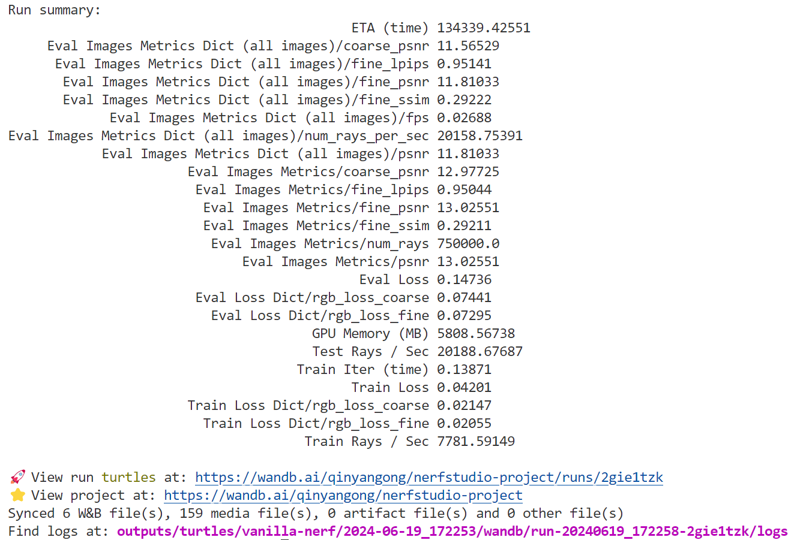

##### Train Loss & Evaluation Loss(W&B)
It stopped training abruptly the first time, so reload checkpoint from outputs/turtles/vanilla-nerf/2024-06-19_160048/nerfstudio_models, which ran 5000 steps.

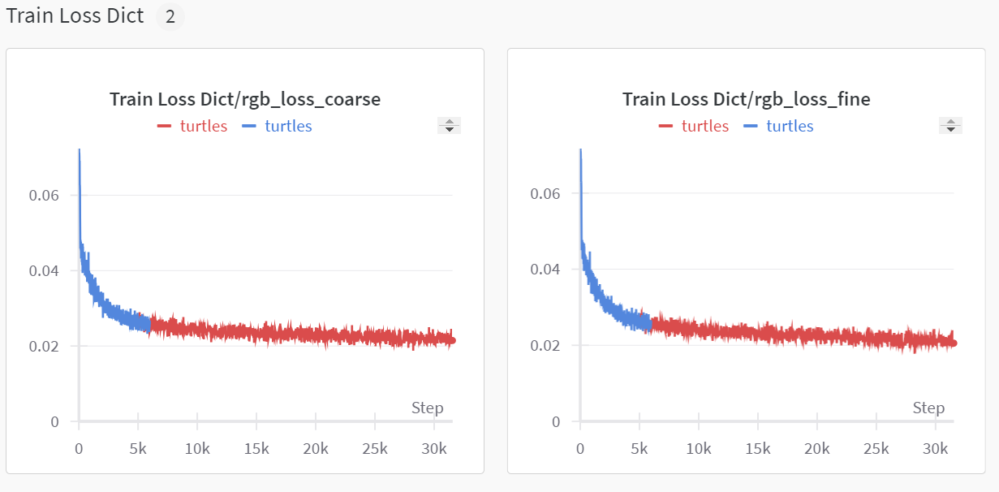

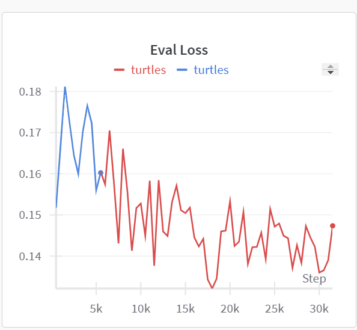

Fail to train vanilla nerf

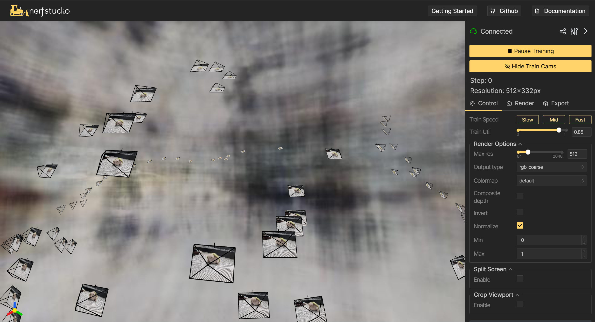

#### Train Gaussian Splatting on Colab
``` ruby
# train splatfacto
! ns-train splatfacto \
--output-dir /content/drive/MyDrive/outputs/splatfacto  \
nerfstudio-data \
--data /content/drive/MyDrive/nerfstudio/turtles/ \
--downscale-factor 4

# resume from checkpoints
! ns-train splatfacto \
--output-dir /content/drive/MyDrive/outputs/splatfacto\
--load-dir /content/drive/MyDrive/outputs/splatfacto/unnamed/splatfacto/2024-06-20_000310/nerfstudio_models \
--data /content/drive/MyDrive/nerfstudio/turtles \
nerfstudio-data\
--downscale-factor 4 
```

It stuck at 88.63%, step 32000:

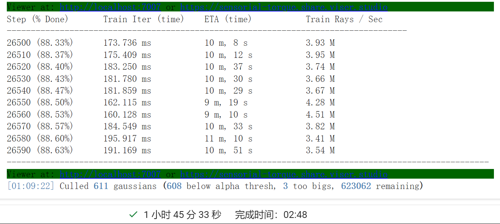

Final checkpoint ended at step 56000:

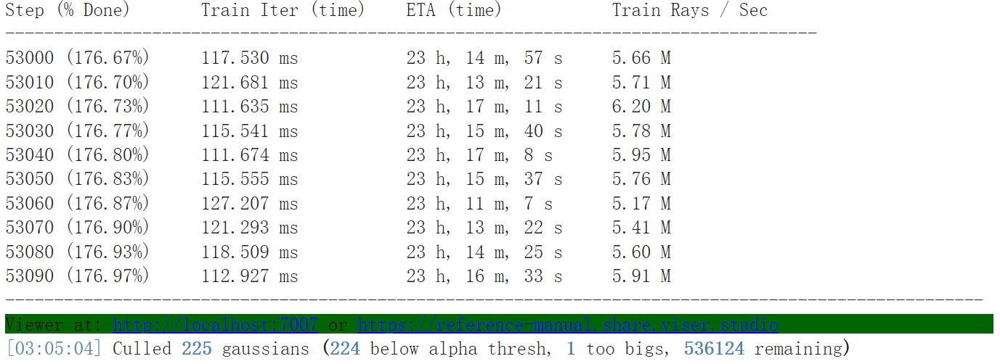

#### Train Gaussian Splatting locally

Stopped at checkpoint: /home/wangzican/outputs/turtles/splatfacto/2024-06-20_021732

```ruby
fatal   : Unsupported .version 7.8; current version is '7.7'
      ptxas fatal   : Ptx assembly aborted due to errors
```

Reinstall cuda11.8 toolkit and update gsplat to the newest version

```ruby
conda uninstall cuda-toolkit
conda list | grep cudatoolkit
pip install torch==2.1.2+cu118 torchvision==0.16.2+cu118 --extra-index-url https://download.pytorch.org/whl/cu118

# download 11.8 cuda toolkit from official website
wget https://developer.download.nvidia.com/compute/cuda/repos/wsl-ubuntu/x86_64/cuda-keyring_1.0-1_all.deb
sudo dpkg -i cuda-keyring_1.0-1_all.deb
sudo apt-get update
sudo apt-get -y install cuda

nvcc --version
pip install ninja git+https://github.com/NVlabs/tiny-cuda-nn/#subdirectory=bindings/torch
pip install git+https://github.com/nerfstudio-project/gsplat
```

Successfully train splatfacto model on turtle dataset: /home/wangzican/outputs/unnamed/splatfacto/2024-06-20_174001

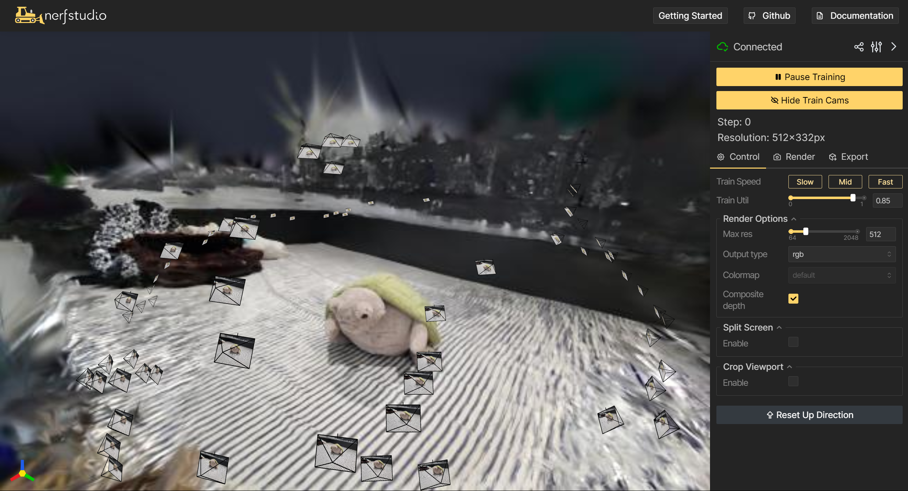

#### Process cecum_t1_a dataset

```ruby
ns-process-data images --data /home/wangzican/data/cecum_t1_a/raw_images  --output-dir /home/wangzican/data/cecum_t1_a  --num-downscales 4
```

##### splatfacto--cecum_t1_a
```ruby
# Train gaussian splatting model
ns-train splatfacto nerfstudio-data --data /home/wangzican/data/cecum_t1_a --downscale-factor 2
# Train from the checkpoint
ns-train splatfacto  --load-dir /home/wangzican/outputs/unnamed/splatfacto/2024-06-21_021715/nerfstudio_models nerfstudio-data --data /home/wangzican/data/cecum_t1_a --downscale-factor 2
```

Checkpoint: /home/wangzican/outputs/unnamed/splatfacto/2024-06-21_021715

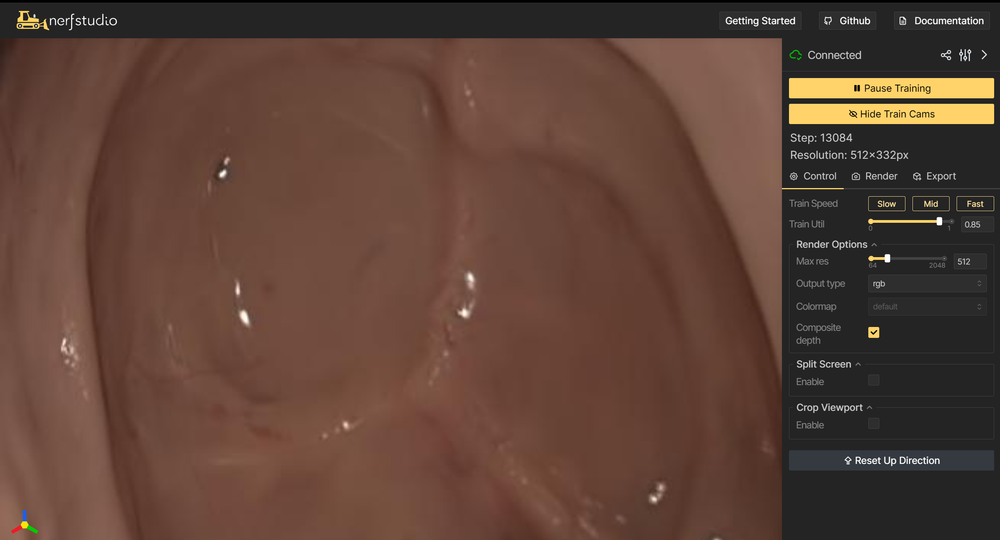

Successfully train splatfacto on cecum_t1_a: /home/wangzican/outputs/unnamed/splatfacto/2024-06-21_025711

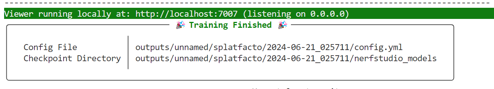

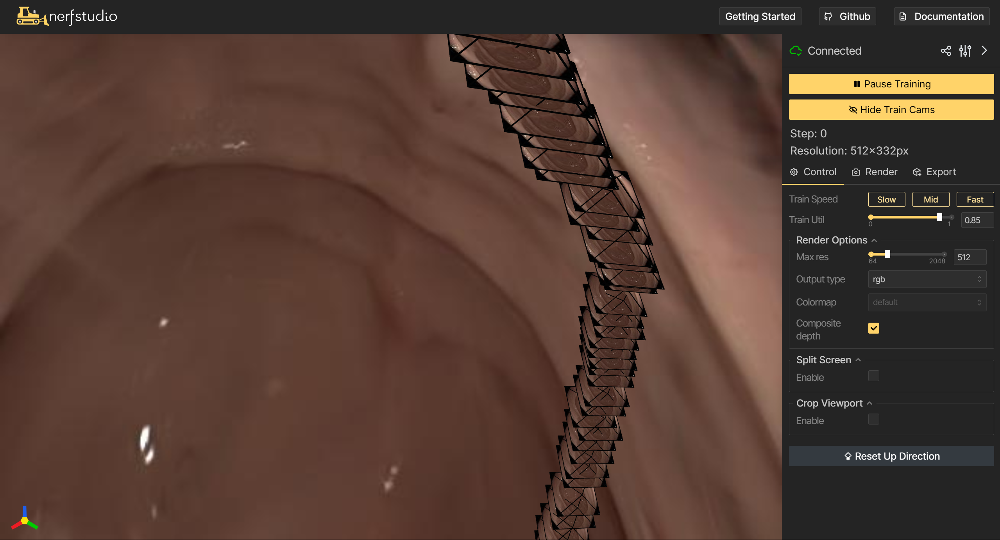

##### nerf--cecum_t1_a

```ruby
ns-train vanilla-nerf --experiment-name cecum_t1_a nerfstudio-data --data /home/wangzican/data/cecum_t1_a --downscale-factor 2
ns-train vanilla-nerf --load-dir /home/wangzican/outputs/cecum_t1_a/vanilla-nerf/2024-06-21_123013/nerfstudio_models --experiment-name cecum_t1_a nerfstudio-data --data /home/wangzican/data/cecum_t1_a --downscale-factor 2
ns-viewer --load-config {/home/wangzican/outputs/cecum_t1_a/vanilla-nerf/.../config.yml} --viewer.default-composite-depth False
```


#### mip-nerf--cecum_t1_a


Both nerf and mip-nerf are very slow and hard to train.

#### Comparasion between nerf and mip nerf on W&B


#### D-Nerf 
With nerfstudio:
The training process is extremely slow


Start from last run:


Run time: 


Comparasion among Nerf, Mip-Nerf, and D-Nerf:


On Colab with D-Nerf original code:
The Colab code is stored in [D_nerf.ipynb](/D_nerf.ipynb)

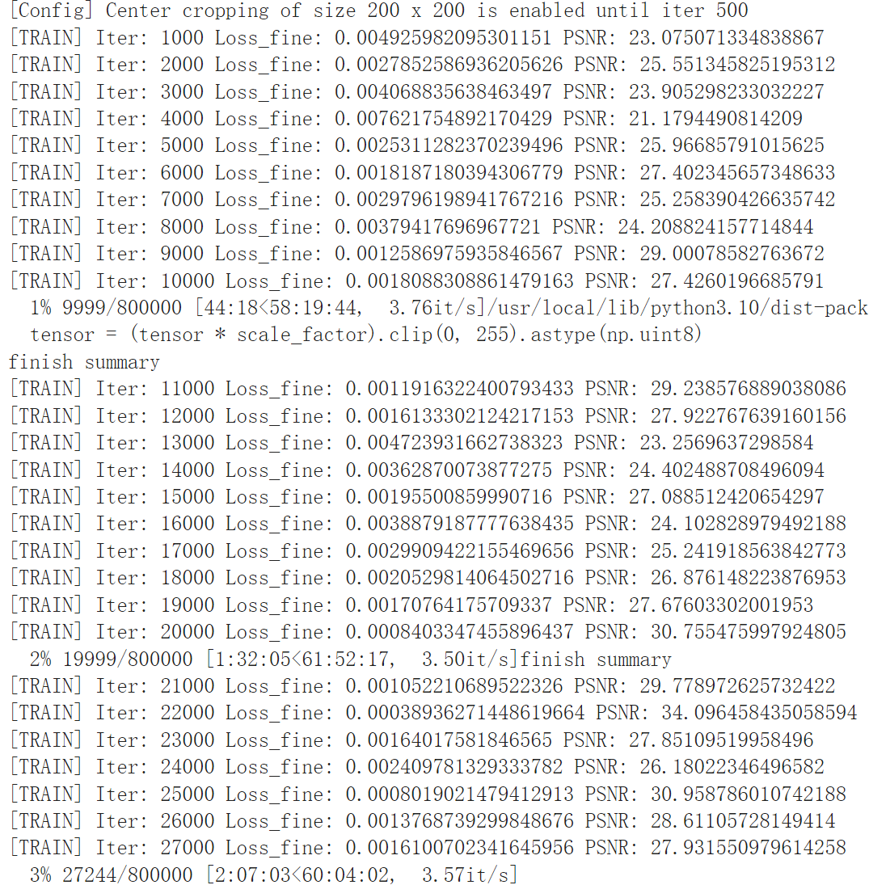

&nbsp;
----------
&nbsp;
> ###### [Next Week](Week8.md)
