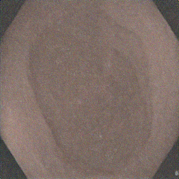
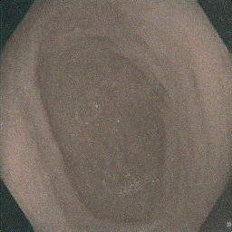
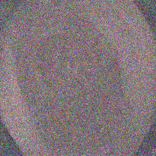
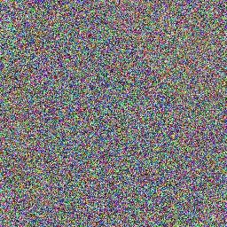
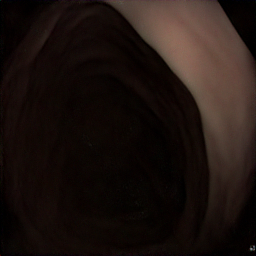
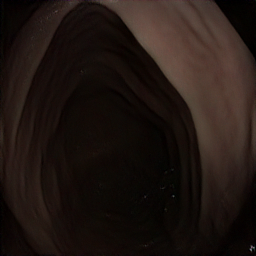
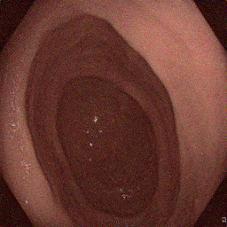

----------
###### Title: 2024 Robotics and Computation Dissertation - Week 8
###### Date: 8-07-2024 -- 13-07-2024
----------
###### Monday-Sunday

#### Train Diffusion models : Denoising Diffusion Probabilistic Model (DDPM) & Denoising Diffusion Implicit Model (DDIM)

- Use DDPM & DDIM pipeline, scheduler, and UNet models in diffusier library for training a denoising diffusion model

#### The result for DDPM & DDIM denoising noise image twice

###### Output images processed by DDPM from sampled noise with 10 inference timesteps 

| First Image   | Second Image |
| ------------- | ------------ |
|   |  |

##### Output images processed by DDIM from sampled noise with 10 inference timesteps

|First Image|Second Image|
|:-:|:-:|
|||

##### Output images processed by DDPM & DDIM from noisy sample image

|12 Steps DDPM|100 Steps DDPM|12 Steps DDIM|
|:-:|:-:|:-:|
||||

#### Conclusion:
- The DDPM pipeline is adapt to generate image from pure noise while DDIM from images being added noise on
- The reason could be DDIM captures the non-Markovian properties between x0 and xt: x0 is not just affected by x1 but also by xt (the noisy image we provide).
- Therefore, I will choose DDIM pipeline to be integrated into GSDiffusion model

&nbsp;
----------
&nbsp;
> ###### [Next Week](Week9.md)
